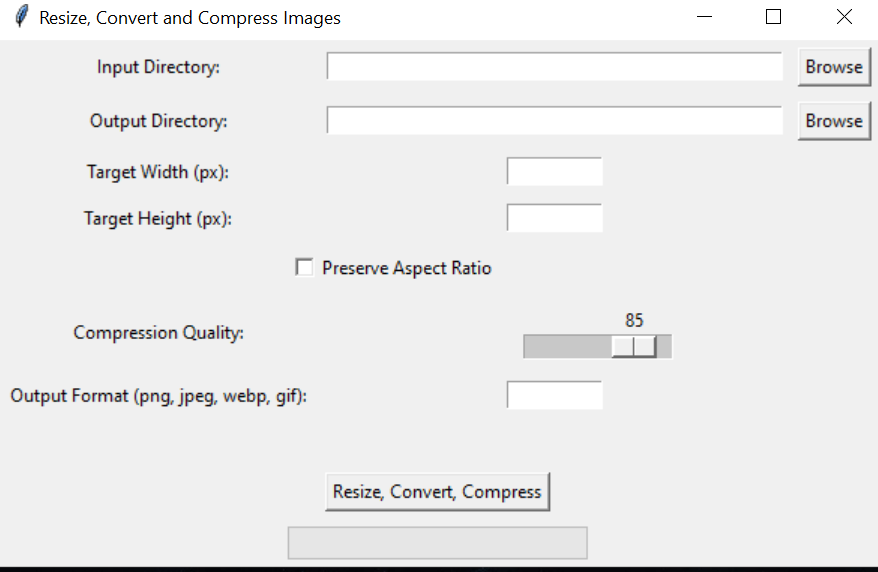

# Image RCC (Resize, Convert, Compress)

Image RCC (Resize, Convert, Compress) is a python based GUI program to resize, convert formats and compress local images and image directories.

The program asks for an input directory of images and/or subdirectory for images and asks for a single output directory. The program
parses through all images and subdirectories of the input directory to look for files matching the ".png", ".jpg", "jpeg", ".gif", ".webp" formats and converts them
based on the relevant inputs in the GUI. 

For example, if given an input directory of ```normal_images``` as follows:
```
├── normal_images
│   ├── ferrari_images
│   │   ├── ferrari.jpeg
│   │   ├── enzo.gif
│   ├── lamborghini_images
│   │   ├── lambo.png
│   │   ├── ferrurcio.webp

```

And given an output directory as ```output_images```, the system will automatically RCC on all the images and create subdirectories to follow 
the structure of ```normal images```. The output could be as follows (assuming we convert everything to ".png" format):
```
├── output_images
│   ├── ferrari_images
│   │   ├── ferrari.png
│   │   ├── enzo.png
│   ├── lamborghini_images
│   │   ├── lambo.png
│   │   ├── ferrurcio.png

```

All image names will remain the same. 

## How to run the program?

1. Ensure you have Python and pip installed. This program was built on Python version 3.11.1
2. Clone the repository and enter the directory
3. Run ``` pip install -r requirements.txt ```
4. Run ``` python ImgRCC-GUI.py ```


## What are the inputs that the user can give?
The GUI looks as follows:


The user will have the following inputs to consider:
- Input Directory
- Output Directory
- Target Width (in pixels)
- Preserve Aspect Ratio:
    - if checked, the program preserves the aspect ratio of the original image based on the provided target width.
    - if unchecked, the program asks you to enter the Target Height of the output image in pixels.
    
    
- Compression Quality, set on a slider. The default compression is 85%.
- Output Format (png, jpeg, webp, gif).
    - Do note that there is no difference between jpeg and jpg formats so please enter "jpeg" to get jpg output images.
    - There is no need to enter a "." before the output format. For example if you want a png output, just enter "png" and not ".png"

Once all details are clarified, users can click on the ```Resize, Convert, Compress``` button. 

The progress bar will showcase the progress of the conversion and you should receive a success message if everything goes well.

## Future work

Some aspects to improve in the future would be to:
1. [ ] Improve GUI UI/UX
2. [ ] Add more image processing techniques (based on feedback)
3. [ ] Miscellaneous Optmisations